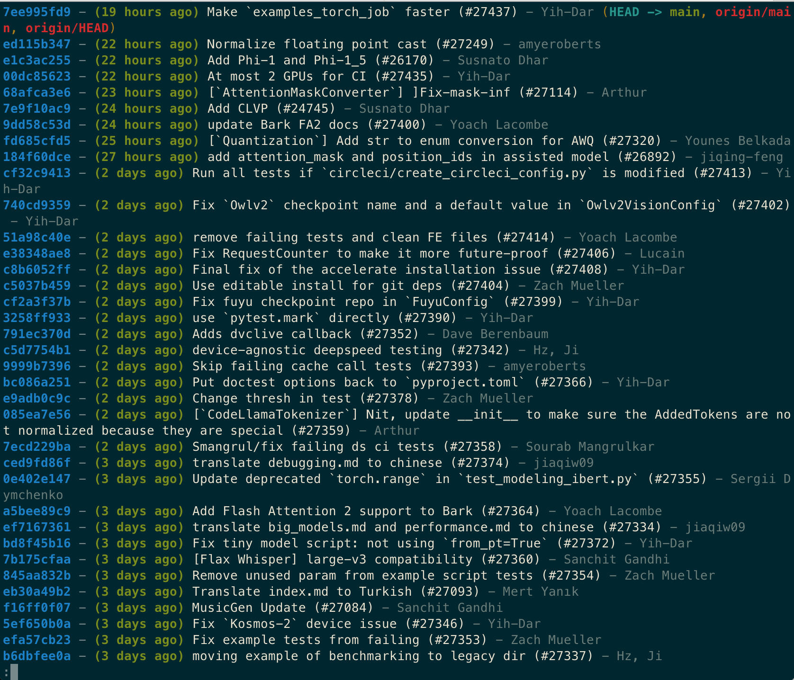
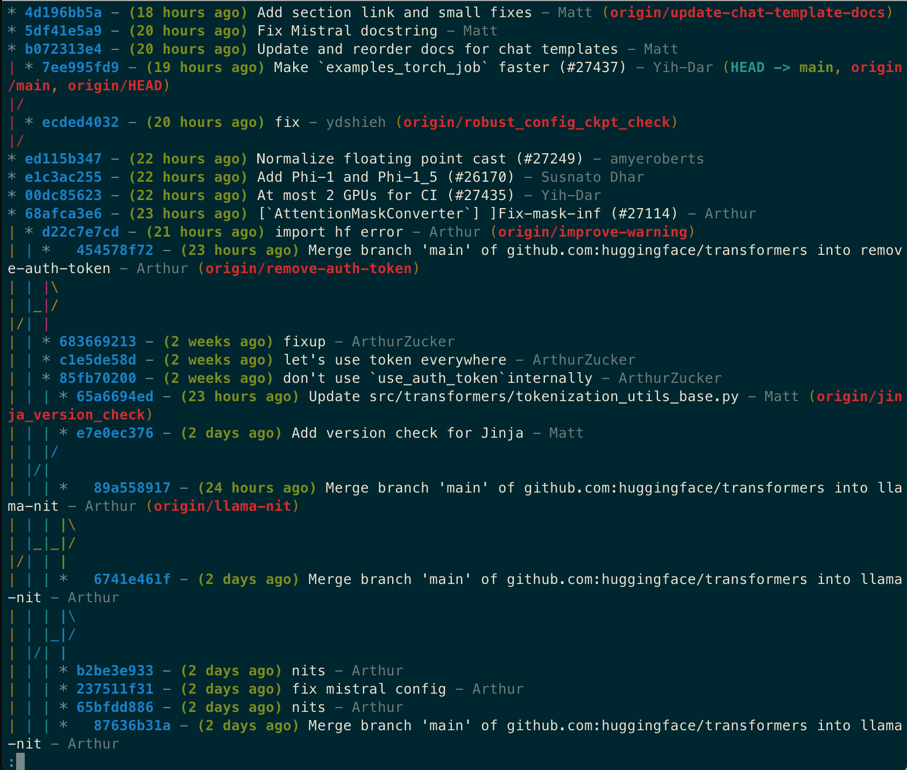
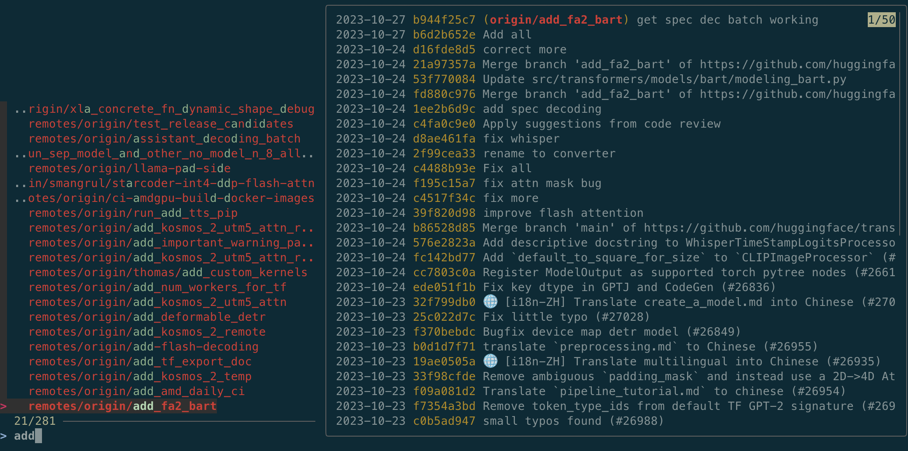

# Git Tips and Tricks for Effective Developers

- [Git Tips and Tricks for Effective Developers](#git-tips-and-tricks-for-effective-developers)
  - [Two key advices on Git](#two-key-advices-on-git)
  - [Some good guides on Git](#some-good-guides-on-git)
  - [Git daily scenarios with tips](#git-daily-scenarios-with-tips)
    - [Feature branch workflow](#feature-branch-workflow)
    - [Pull Request review](#pull-request-review)
    - [Merge conflicts](#merge-conflicts)
    - [Preparing commit](#preparing-commit)
  - [Git effective setup](#git-effective-setup)
    - [Better git log](#better-git-log)
    - [Git status with less](#git-status-with-less)
    - [Fuzzy search for branch checkout](#fuzzy-search-for-branch-checkout)

## Two key advices on Git

* **Use git in command line**. Don't use apps. Don't use git buttons embedded in your IDE (VSCode, IntelliJ etc.). Git command line client is just a more efficient tool. Much like riding a bycicle: once you learn how to use it, you can use it for the rest of your life.
* **Spend some time to learn git**. It can save you countless hours in future. Avoid using unreliable tutorials and courses. Instead consider Atlassian's online textbook. Check out recomendations below.

## Some good guides on Git

| Guide                  | Purpose                                              |
|------------------------|------------------------------------------------------|
| https://www.atlassian.com/git | A very good textbook. There are parts both for beginners and advanced users |
| https://ohshitgit.com/ | Common mistakes and problems explained. For everyone |
| https://learngitbranching.js.org/ | Interactive Git simulator. It's my top recomendation for complete beginners |

## Git daily scenarios with tips

Disclaimer. Here I consider usage of standard [feature branch workflow](https://www.atlassian.com/git/tutorials/comparing-workflows/feature-branch-workflow). This flow is widely used in modern microservice architecture and CI/CD pipelines.

### Feature branch workflow

Create a new branch, work on it for a while, push, pass tests and builds, finally create a Pull Request.

```
# Create new branch and checkout it
git checkout -b JIR-123-new-feature

# Change your code, do commit the changes
git add file_1.py
git add file_2.py
git commit -m 'JIR-123 changed file_1 and file_2'

# This will create a new branch on the server
git push -u origin HEAD

# Your build is failed! Fix it
git add file_1.py

# This approach helps you not to spam commits like 'fix', 'fix', 'fix'
# Caution. Use only in your personal branch!
git commit --amend --no-edit
# no-edit keeps commit message unchanged. If you want to change it use
git commit --amend
# Force push, rewrite the history
git push -f

# In a shared branch just create new commit
git commit -m 'JIR-123 fixed file_1'

# At this point of time you may want to create a Pull Request
```

### Pull Request review

Go through multiple iterations of code review. Commit the changes. Squash 'fix' commits after you finally get your approve.

```
# Checkout your branch
git checkout JIR-123-new-feature

# Fix after the first review iteration
git add file_1.py
git commit -m 'JIR-123 changed file_1.py'
git push

# Fix after the second review iteration
git add file_1.py
git commit -m 'JIR-123 changed file_1.py'
git push

# Finnaly, your PR is approved
# Reduce number of commits using "squash" for better readability
# Option 1. Leave one commit in the branch
git rebase -i master
# Option 2. Squash only 'fix' commits
git rebase -i HEAD~2
# Force push, rewrite the history
git push -f

# Your reviewer approves again. You're allowed to merge
```

[Freecodecamp.org: Tutorial on squashing](https://www.freecodecamp.org/news/git-squash-commits/)

Note. Some Git hosting services provide an option to merge with squash in UI.

<details>
<summary>Why you shoudn't use git commit amend / push -f during code review</summary>
<p>When you rewrite the history, the reviewer can't see what changed from the previous iteration, and it becomes quite annoying to check that you fixed the code in a way it was intended</p>
</details>

### Merge conflicts

Disclamer. Actually, developers are devided on two camps in the question of conflict solving. The first one prefers rebases. The second one prefers merges. This guide encourages using rebases, since they produce linear history which is much easier to read and maintain.

[Atlassian blog: Merge or rebase?](https://www.atlassian.com/blog/git/git-team-workflows-merge-or-rebase)

Regular rebases allows you not to get too far behind of master or your main branch. Yes, you will have to solve conflicts more frequently but in rather small portions. Keeping your branch too far away from master may lead to a very painful merge at the end.

```
# When you come to work, in your feature branch
git checkout JIR-123-new-feature
# Keep you uncommited changes to the temporary storage
git stash
# Do rebase
# Caution. Use only in your personal branch!
git rebase master

# You will probably need to solve conflicts

# If something went wrong
git rebase --abort

# If you fixed the conflicts
git add file_1.py
git rebase --continue

# If you want to return evertything back
git checkout origin/JIR-123-new-feature
git branch -f JIR-123-new-feature

# If rebase is ok

# Return uncommited changes
git stash pop
# Force push, rewrite the history
git push -f

# After rebase you will have zero conflicts with master
```

### Preparing commit

Add only necessary changes to your commit. Avoid committing `.DS_Store` and other unwanted files.

```
# Bad approach
git add .
# You will end up with unwanted files

# Option 1. Add all files and directories manually
git add file_1.py
git add dir_1

# Option 2. Add only changed files automatically
# Adds no new files
git add -u
# Add new files manually
git add file_2.py

# Don't forget to check the status
git status

git commit -m 'JIR-123 changed some files'
```

Problem solving

```
# You occasionally added an unwanted file to staging
git add file_1.py
# Solution
git reset file_1.py

# You occasionally commited unwanted file
git add file_1.py file_2.py
git commit -m 'JIR-123 changed something'
# Solution
# Cancel you last commit. Return to the previous one
# All changes are in staging
git reset --soft HEAD~1
# Remove unwanted file from staging
git reset file_1.py
# Commit again
git commit -m 'JIR-123 changed something'

# Sometimes you want to abandon some changes before adding files to staging
# This is equialent to git reset --hard but for a single file
git checkout file_3.py
# Disclamer: there is a more safe version
# It's necessay if the branch and the file have the same names. Not happen in practice
git checkout -- file_3.py
```

It's highly recommended to undestand how `reset` works. [The official documentation page](https://git-scm.com/docs/git-reset) may seem quite vague, so check out this [short](https://stackoverflow.com/a/3528483) and [very short](https://stackoverflow.com/a/50022436) explanation on StackOverflow.

More explanations of how to use `git checkout` for reseting changes can be found in [this](https://stackoverflow.com/questions/7147270/hard-reset-of-a-single-file) StackOverflow topic.


## Git effective setup

### Better git log

You may know that [git log](https://git-scm.com/docs/git-log) has many formatting options. Although, all predefined formats (e.g. `--oneline` and `--short`) have some drawbacks. So, the best way is to set the format string manually.

This code is inpired by [this](https://stackoverflow.com/a/9074343/1849828) StackOverflow answer but have some differences

Add to your `~/.gitconfig`

```
[alias]
lg = log --abbrev-commit --decorate --format=format:'%C(bold blue)%h%C(reset) - %C(bold green)(%ar)%C(reset) %C(white)%s%C(reset) %C(dim white)- %an%C(reset)%C(auto)%d%C(reset)' --first-parent
lgg = log --abbrev-commit --decorate --format=format:'%C(bold blue)%h%C(reset) - %C(bold green)(%ar)%C(reset) %C(white)%s%C(reset) %C(dim white)- %an%C(reset)%C(auto)%d%C(reset)' --graph
```

What the format provides you
* Short commit hash
* Relative time
* Commit message
* Author name
* Branches and tags
* All oneline


| Command | Scope | Use Case |
| - | - | - |
|`git lg` | Commits from the current branch. No commits from merged feature branches | To check what came from the server. To check that your made your commit in a right place. To explore a new repository |
|`git lgg` | Commits from the current branch with feature branches. Draws the graph | To check out commits from feature branches |
|`git lgg --all` | Commits from all branches. Draws the graph | To explore non-merged branches |




### Git status with less

`git status` may become huge. Particularly, when you add dependencies in you repo (like we do in golang).

In such cases `git status` command returns a very long output that could be annoying. It is possible to use `less` to solve it (I personally use `bat` as `less` substitution)

```
git status | less
```

But such output will loose colors which reduces its readability. Add the following to `~/.gitconfig` to fix it

```
[color]
status = always
```

### Fuzzy search for branch checkout

`git checkout branch-name` can be very annoying in a production level repository because of a very large number of branches. I recommend to use `fzf` command-line tool to perform fuzzy search over branches.

A detailed tutorial on how to set up this feature can be found in [this](https://polothy.github.io/post/2019-08-19-fzf-git-checkout/) post

Here is how it looks




TLDR

1. Install [zsh](https://github.com/junegunn/fzf#installation) if you havn't alredy
2. Add the following code to your `.zshrc`/`.bashrc` config
3. Use `gch` command instead of `git checkout`

```
fzf-git-branch() {
    git rev-parse HEAD > /dev/null 2>&1 || return

    git branch --color=always --all --sort=-committerdate |
        grep -v HEAD |
        fzf --height 50% --ansi --no-multi --preview-window right:65% \
            --preview 'git log -n 50 --color=always --date=short --pretty="format:%C(auto)%cd %h%d %s" $(sed "s/.* //" <<< {})' |
        sed "s/.* //"
}

fzf-git-checkout() {
    git rev-parse HEAD > /dev/null 2>&1 || return

    local branch

    branch=$(fzf-git-branch)
    if [[ "$branch" = "" ]]; then
        echo "No branch selected."
        return
    fi

    # If branch name starts with 'remotes/' then it is a remote branch. By
    # using --track and a remote branch name, it is the same as:
    # git checkout -b branchName --track origin/branchName
    if [[ "$branch" = 'remotes/'* ]]; then
        git checkout --track $branch
    else
        git checkout $branch;
    fi
}

alias gb='fzf-git-branch'
alias gch='fzf-git-checkout'
```